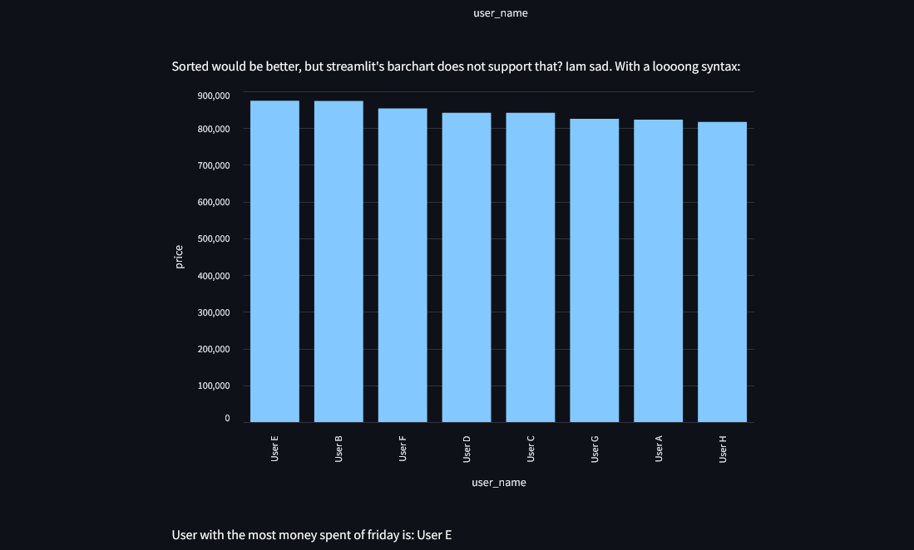
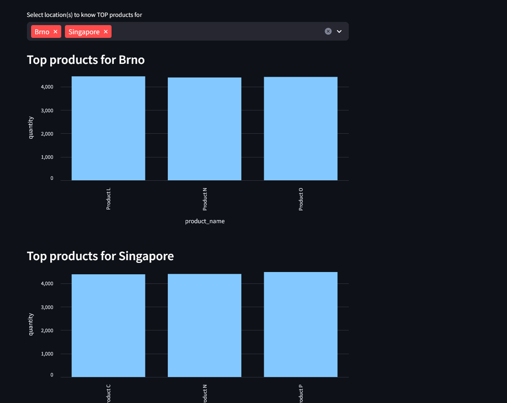

## Introduction

This is a solution to the analytical task for Meiro company.
From my perspective, this tasks is a prime example of a fake task designed to test analyst's thinking and
skills rather than get something done. I mean it even uses fake data :).

Therefore, even before reading the task, I've decided to rather focus on showcasing how I tend to work/think, tools
I use and don't use and just have some sort of fun &/ learning experience with it.

Therefore, I've set these tools to be used:
- Postgres if SQL DB needed (I tend to use Redshift these days, but postgres seems easier to setup)
- DBT for DB manipulation
- Python for...well everything else
- Streamlit for data visualizations (Used to be quite a big hype about it a while back, decided to give it another shot - Used to use Plotly's Dash)


## Limitations
There are also some "limitations" or things I did not worry about, but in anything but these kinds of tasks they would be essentials.

- Text tone - I can write corporate BS, trust me. I just don't like it, so this is written super casually. ChatGPT would not be amused.
- Security & proper DB management
  - Using postgres user and PW...
  - Using public schema...
  - ...
- Automation 
  - I did not mind creating DB manually for instance
  - Docker compose **DOES not run the app and everything**. I doubt anybody is going to attempt to run it, but if so, please, let me know and i will adjust.
- Code best practices
  - I did not worry about naming, proper abstraction etc.
  - Also, please note I've formatted SQL by Pycharm's formatter. If it looks weird, so be it.
  - Full documentation, descriptions etc.
  - Git
- Performance - I have not worried about performance much. There might be a faster approach than df.apply for example
but for this kind of task I think is alright. Same goes for SQL related queries. Clarity > Performance here.


## Approach

1. I've read the task description. Notes:
   1. It took me well over 2 hours. Dunno, if I went with just the SQL approach I could have made it, but it took me bit more...
   2. Seems super focused on SQL solution. However, was already set on using a bit of python....
2. Since it's focused on SQL, I've decided to NOT transform data in python, rather just explore a bit and import it into DB.
   1. Spun a Postgres instance via docker compose. Definition [here](docker-compose.yml)
   2. Attempted to just copy data to postgres, but the official image does not have psql or I did not manage to run it. Got mad while installing PSQL on WSL and decided to rather go with python.
   3. Explored data via python. Link to import script [here](import_raw_data.py). notes:
      1. Created python virtual environment and installed required dependencies, [see](requirements.txt)
      2. Explored data a little bit just by checking it in ipython.
      3. Extracted keys (future column names) in order to not miss some keys in rows further down the file. Expected Quantity key being somewhere inside products
   4. Imported raw data to postgres with virtually no transformations.
      1. This should somewhat follow ELT process. 
3. Extracted raw data into fact and dimension tables via dbt
   1. Installed DBT and inited dbt project; installed dbt deps
   2. Found out pycharm 2024 supports dbt natively, so I installed it, and it's quite nice :)
   3. Created dimension tables:
      1. [Users](meiro_dbt/models/users.sql). Here I've decided not to create a dim table for city. This is pure laziness on my part.
      2. [Products](meiro_dbt/models/products.sql).
   4. Created fact table [product_order](meiro_dbt/models/product_order.sql)
      1. I thought about denormalizing or not a bit. Probably having an order table containing column with list of products purchased would be cleaner and a right way to go. Having product_order table does not feel right. I however
went with it as it seemed easier to query. For this example case it's imho fine, but it's probably not a way to go...
   5. Since I've decided in the beginning I would be using Streamlit for visualization I knew It would be easier to make a denormalized table and load that into pandas DataFrame,
hence [here](meiro_dbt/models/full_denom.sql) is a view definition of the view used for further exploration in python/streamlit.
      1. Note about joins. On the test data with the tests(see bellow) inner *should* be fine
   6. About models:
      1. These days at our company, we do not even attempt to actually model our DWH. We sort of just dump denormalized data and Redshift takes care of the rest. Well, performance at least...Surprisingly enough, nobody complains and it seems to work :). Just mentioning
      2. I went with basic [start schema](https://en.wikipedia.org/wiki/Star_schema), since the task sort of demanded it. For
the purpose of this concrete task and the way it has been approached it is a bit of [link](https://content.imageresizer.com/images/memes/rick-and-morty-slavery-with-extra-steps-meme-1jihm4.jpg). Hope this made you laugh a bit.
   7. Added dbt metadata&description. Defined [here](meiro_dbt/models/meiro.yml) 
      1. One important note here are the tests. Iam making certain assumption in the python code. These test allow me to for instance group on name, which is normally quite problematic!
   8. I've taken target directory out of gitignore and setup a github page. [Here](https://lavinavrovine.github.io/meiro_task/meiro_dbt/target/#!/overview) should be the docs generated!
4. Created python script/streamlit app to answer the questions. Script is [here](main.py)
   1. Loaded data into pandas DF
   2. Calculated necessary statistics (see bellow)
   3. Graphed a solution. Did not worry about visualisation best practices whatsoever...
      1. Streamlit doesn't support sort on barchart :(. Had to add a different approach, where the code is more difficult to read. Kept both there just for probably mentioning the graph should look nicer.
      2. Visualisation bellow


## Answers

### Python/Streamlit answers:
[full code](main.py)


`data = pd.read_sql("select * from full_denom", con=engine)`

#### Q1: Which user spent the most money on products on all Fridays?:
Relevant piece of code to get the answer:
```
q1_data: pd.DataFrame = data[data["created_ts"].dt.dayofweek == 4].groupby(["user_id", "user_name"])[
     "price"].sum().sort_values(ascending=False).reset_index()
print(q1_data.at[0, 'user_name'])
```
User E
Visually:



#### Q2: What are the best 3 products in each location of a user based on quantity?

Relevant piece of code to get the answer:

`q2_data = data.groupby(["product_name", "user_city", ]).size().groupby("user_city").nlargest(3, keep="all").droplevel(level=0).reset_index(name="quantity")`
Visually:
(not a good visualization!)



### SQL solution
While writing above, I've realized you probably don't care about the viz nor the python code, so here is SQL code you were probably interested in:
I've added simple SQL statements as dbt analyses.

[Q1](meiro_dbt/analyses/q1.sql))

[Q2](meiro_dbt/analyses/q2.sql))

# End